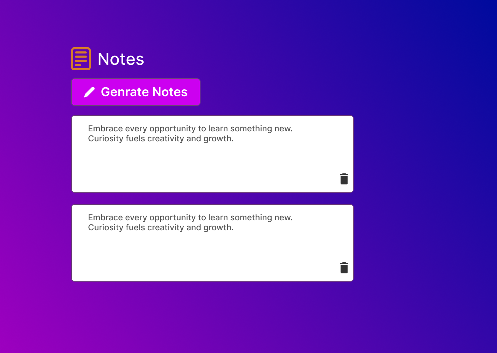

# Generate Notes

A simple and intuitive web application to create, edit, and manage notes. This project is built using **HTML**, **CSS**, and **JavaScript**, with designs created in **Figma**.

  
    

  

## 🚀 Features

- Create new notes .
- Edit existing notes.
- Delete notes you no longer need.
- Fully responsive design for mobile and desktop users.
- Clean and user-friendly interface.

## 🎨 Design

The design prototype was created using **Figma**, ensuring a sleek and modern UI.  
[View the Figma Design](https://www.figma.com/design/rervNKegOt7yXEDeSnH9UC/java-script-project?node-id=94-2&t=W0lRsMDbZAvGGOJD-1) <!-- Replace '#' with your Figma link, if available. -->

## 🛠️ Technologies Used

- **HTML**: For the structure of the application.
- **CSS**: For styling and responsive design.
- **JavaScript**: For functionality, including creating, editing, and deleting notes.
- **Figma**: For designing the layout and user interface.

## Live Demo  
[**View the Live Project**](https://dark1arrow.github.io/Genrate-Notes/)  

## Figma Design  
[**View Figma Design**](https://www.figma.com/design/rervNKegOt7yXEDeSnH9UC/java-script-project?node-id=94-2&t=W0lRsMDbZAvGGOJD-1)  

## LinkedIn 
[**Check LinkedIn**](https://www.linkedin.com/in/gouatm-khanna-61ba63262/?utm_source=share&utm_campaign=share_via&utm_content=profile&utm_medium=android_app)
  